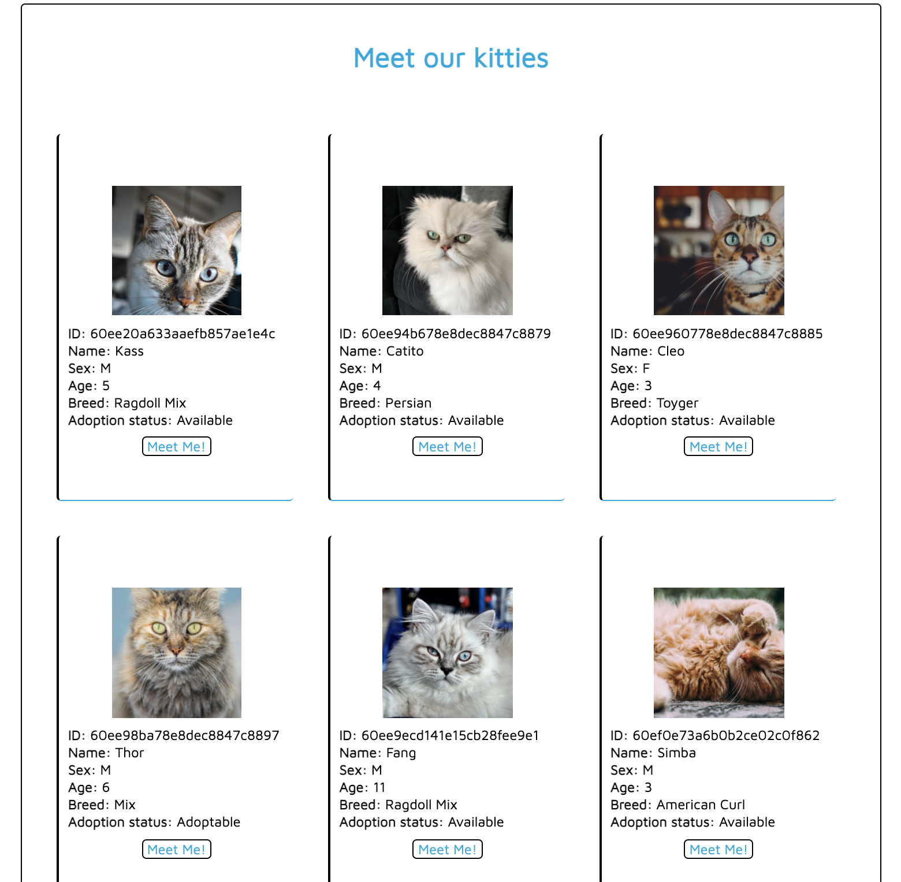
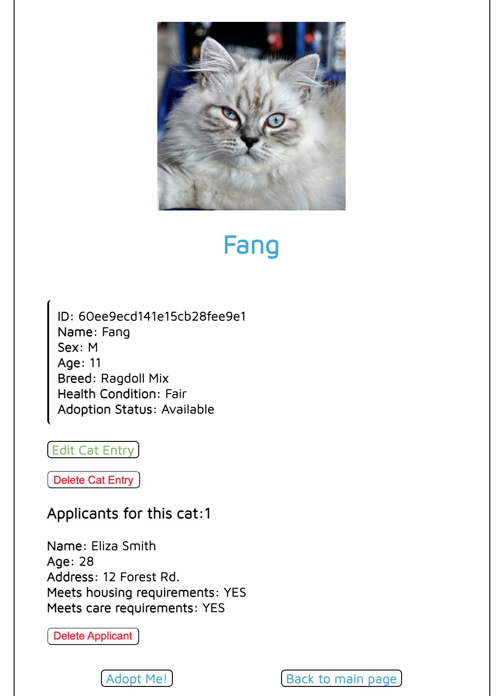
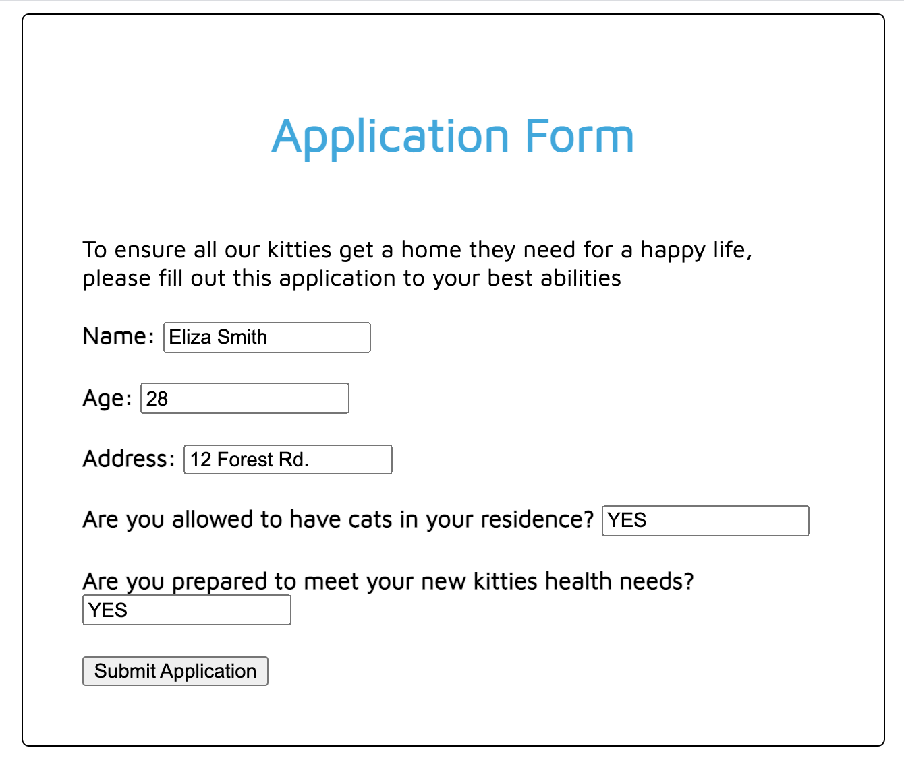

# Happy Paws

Happy Paws is a cat adoption app where applicants can view all cats currently up for adoption and apply to adopt a cat they like. They are able to access the cat's full details and also see how many other applicants the cat may have.
Whileas not fully built out, the app also allows the administrator to update cat details and delete a cat entry when the cat gets adopted.

####Technologies Used: 
The app was built using HTML, CSS, Node.js, Express, MongoDB and Mongoose

#### Getting Started: 

[CatApp](https://cat-app-project-2.herokuapp.com/)  
[CatApp project's Trello Board](https://trello.com/b/A0TD6I68/project-2-node-express-mongodb)

####Planned future enhancements:

* Create a separate view for the administrator that lets them manage all cat entries and applicant forms behind the scenes.
* Adding a feature that stores all of the applicant's info when they adopt a cat, even after the cat entry is deleted.
* Adding a donation feature where users could donate items cats are in need of.
* Styling for a more polished look.